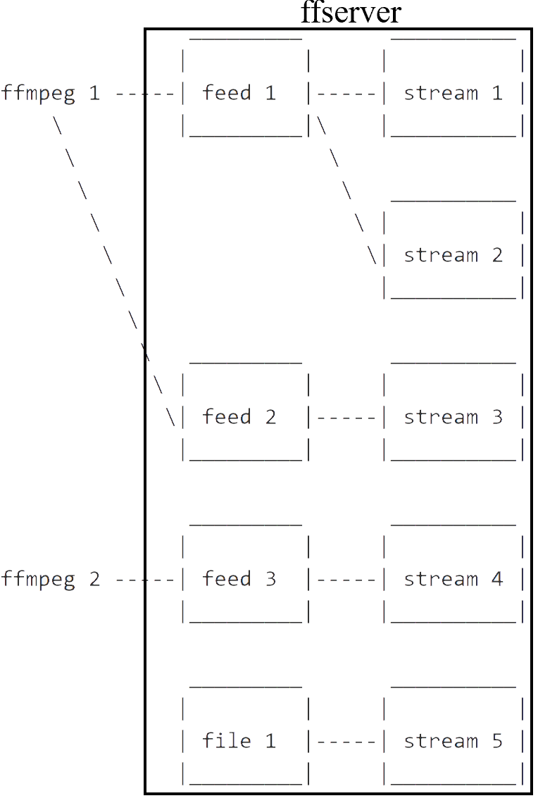

# StreamServer

## Getting Started
[**ffserver**](https://www.ffmpeg.org/ffserver.html)
[**ffmpeg**](https://www.ffmpeg.org/ffmpeg.html)



## Running the test

### Check your webcam device
``` sh
lsusb
```
=> Bus 001 Device 007: ID 046d:081b Logitech, Inc. Webcam C310

### Start ffserver by using designated configuration file
``` sh
ffserver -f ffserver.conf
```

### Encode live video/audio stream to ffserver
``` sh
ffmpeg -f video4linux2 -pixel_format bgr24 -video_size vga -i /dev/video0 http://localhost:8090/webcam.ffm
```
